<h1 align="center">🔥 Dailyfresh-B2C 🔥

这是一个 ☛全栈/全端/全平台☚ 的B2C模式的电商项目, web后台基于Django2.0 + Python3.6,  前后端分离，前端使用Vue框架开发。移动端基于Flutter开发，一套代码支持Android&amp;IOS平台。微信小程序基于mpvue框架开发。

## NOTE
🚧 此项目依然在开发中, 工程量较大, 等段时间全部开发到后期以后会全部开源出来大家一起学习。

<h1 align="center">Backend</h1>

## 🔨 技术栈
* Python3.6
* Django2.0
* DjangoRestFramework
* Mysql
* Redis
* OAuth
* Pay

## 📕 开发文档 (TODO)...

## 🌟 截图

    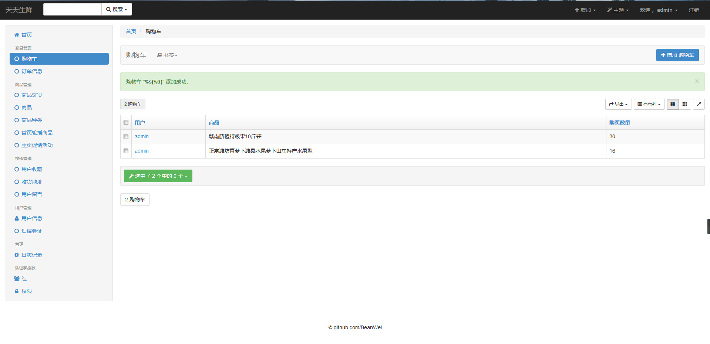
    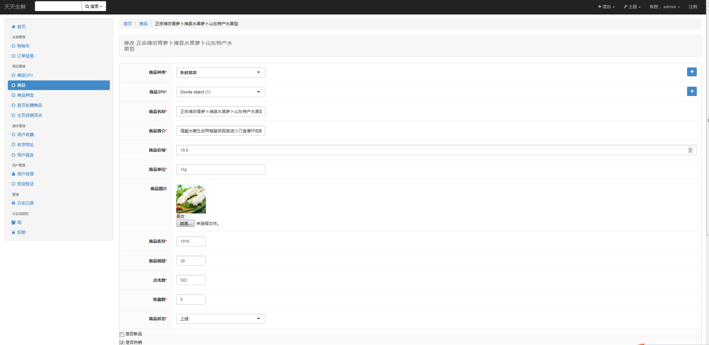

    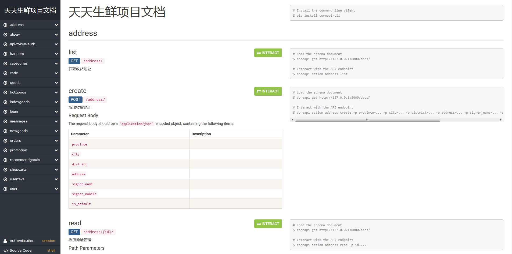
    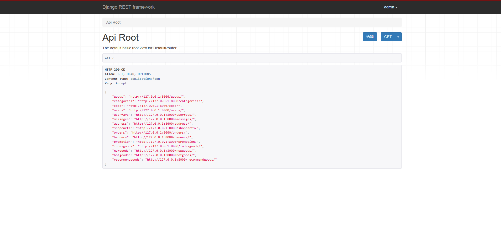

<h1 align="center">Front</h1>

## 🔨 技术栈
* Vue
* axios
* element-ui

## 📕 开发文档 (TODO)...

## 🌟 截图

    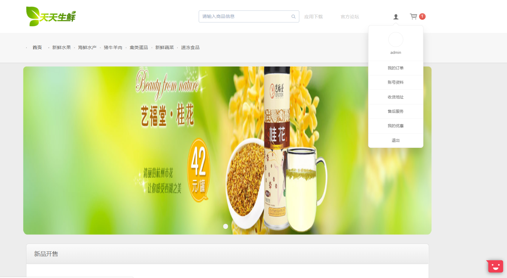
    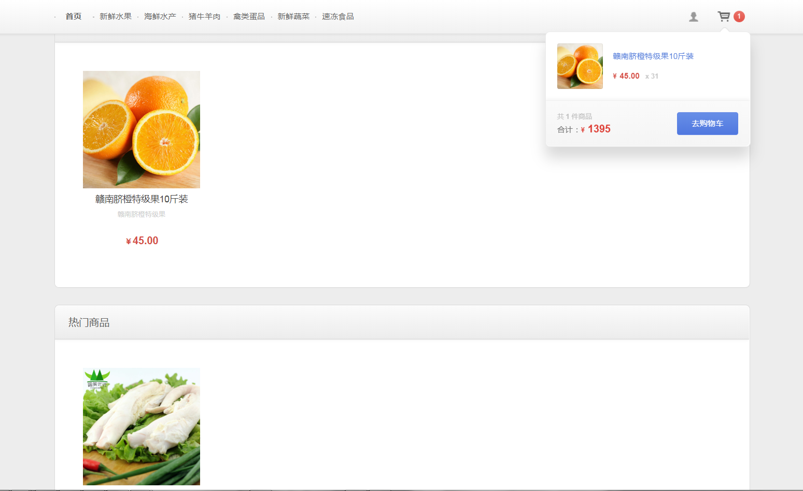

    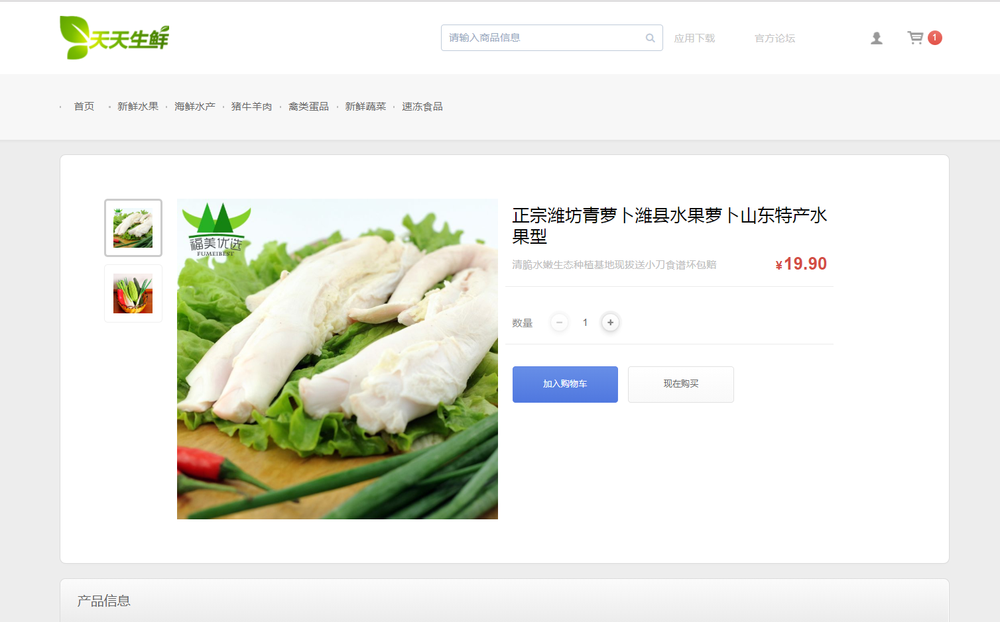
    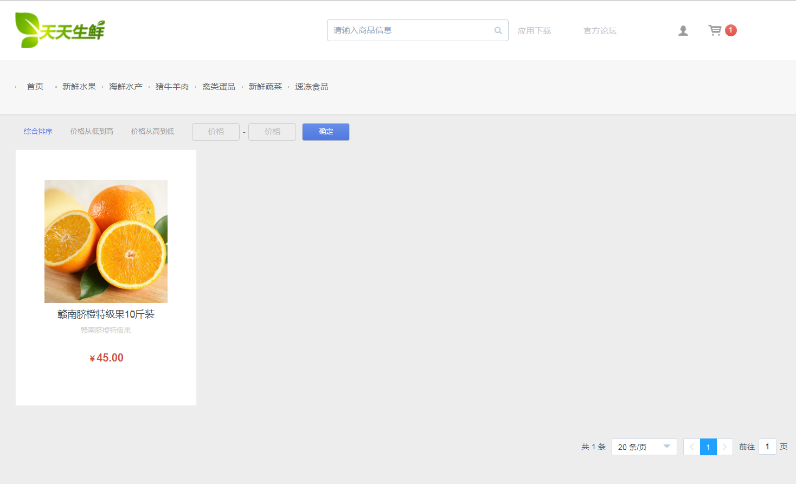

    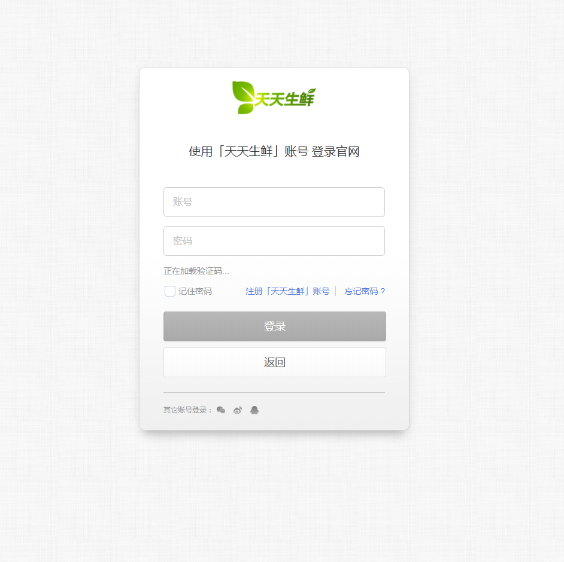
    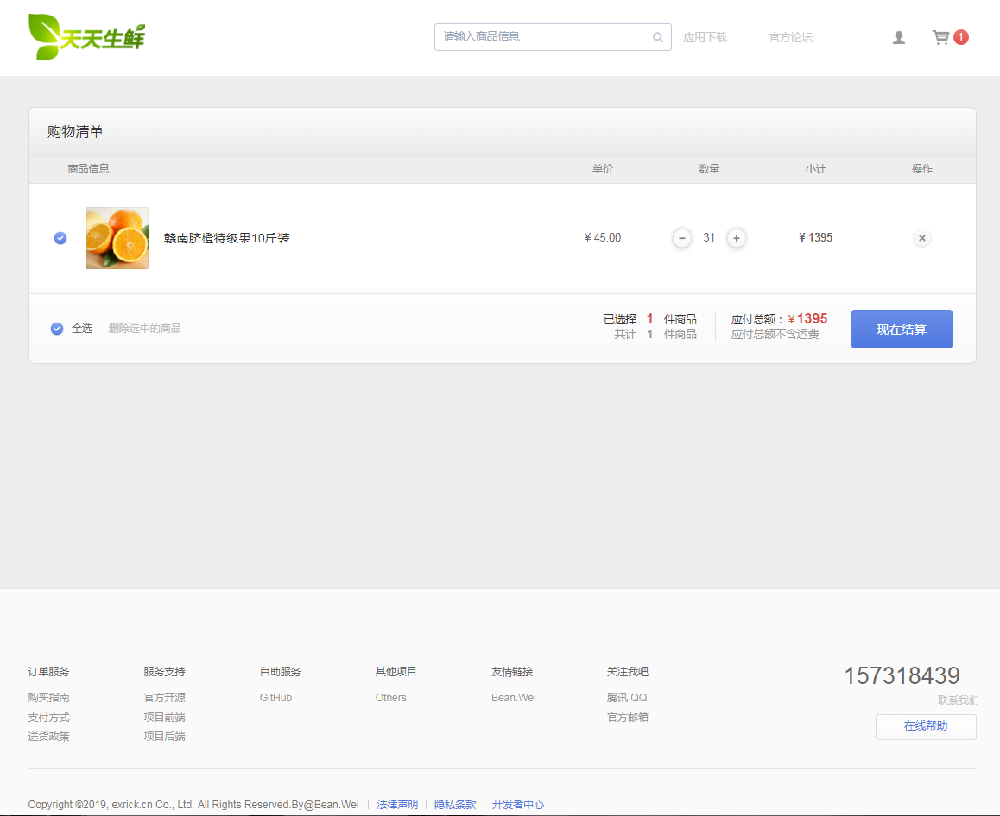

    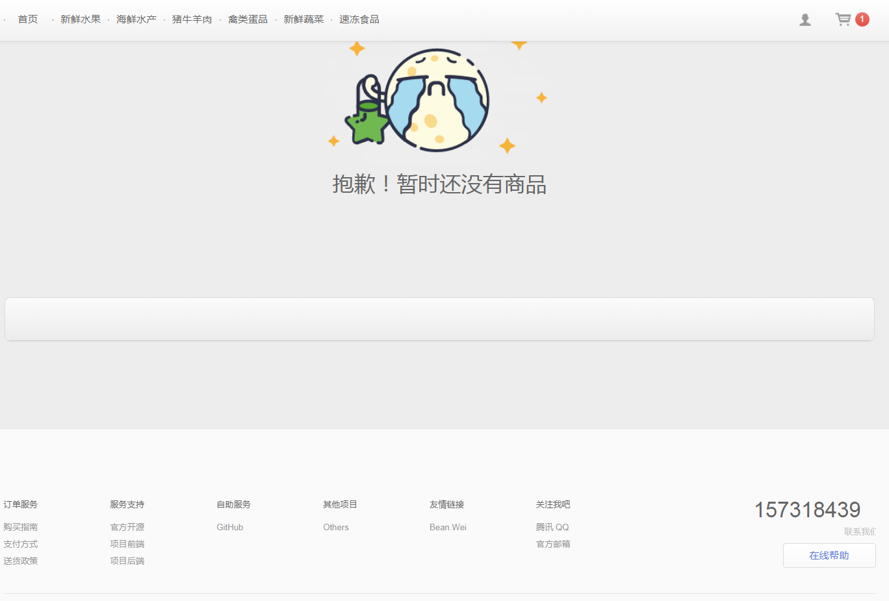

<h1 align="center">Mobile</h1>

## 🔨 技术栈
* Flutter

## 📕 开发文档 (TODO)...

## 🌟 截图

    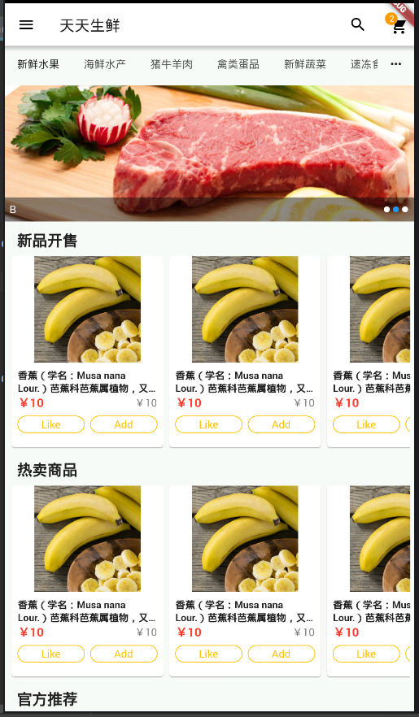
    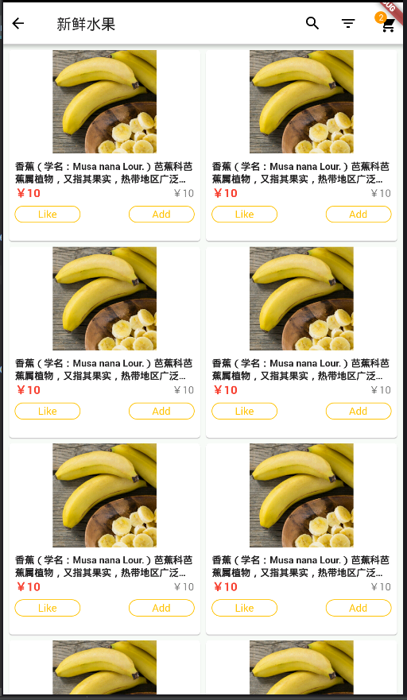
    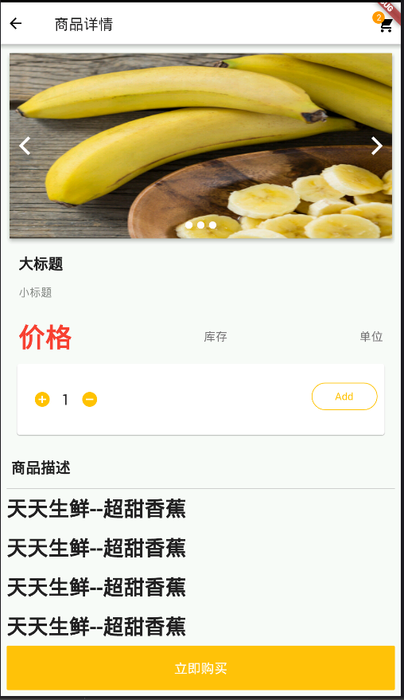
    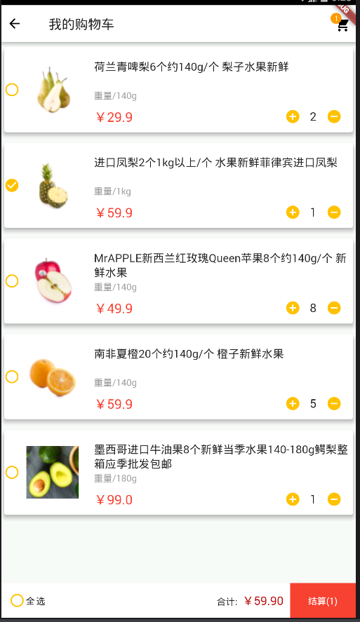

<h1 align="center">WechatMiniProgram</h1>

## 🔨 技术栈
* mpvue

## 📕 开发文档 (TODO)...

## 🌟 截图

# LICENSE
@Apache License 2.0